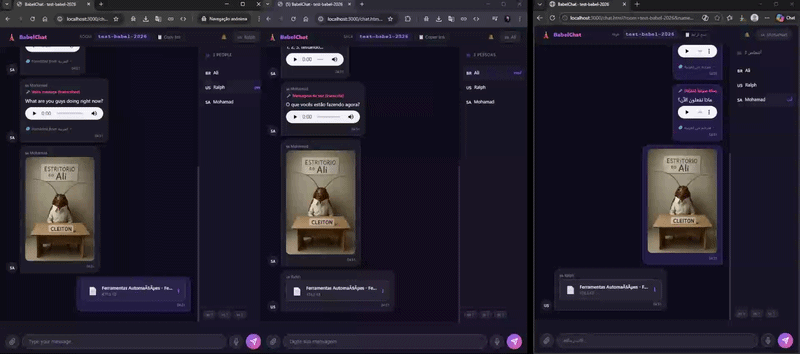
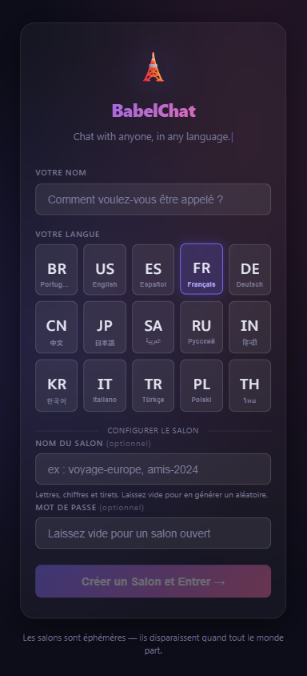
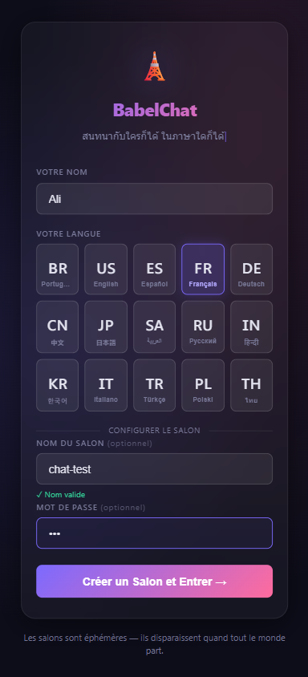
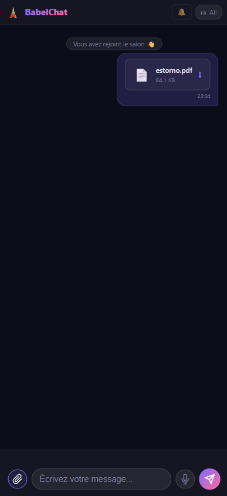

# 🗼 BabelChat

**Converse com qualquer pessoa, em qualquer idioma.**

Chat em tempo real onde cada mensagem é traduzida automaticamente para o idioma de cada participante usando IA. Sem barreiras, zero configuração.



---

## Como funciona

1. Você entra numa sala e escolhe seu idioma
2. Outra pessoa entra na mesma sala e escolhe o idioma dela
3. Vocês conversam normalmente — cada um lê tudo no seu próprio idioma
4. A tradução acontece em tempo real via GPT-4.1 Nano

```
🇧🇷 João: "Olá, tudo bem?"
         ↓ IA traduz automaticamente
🇺🇸 Mary vê: "Hello, how are you?"
🇯🇵 Yuki vê: "こんにちは、元気ですか？"
```

## Screenshots

<p align="center">
  
  
  
</p>

## Features

- **15 idiomas** — PT, EN, ES, FR, DE, ZH, JA, AR, RU, HI, KO, IT, TR, PL, TH
- **Interface traduzida** — a UI inteira muda de idioma ao clicar na bandeira
- **Imagens, arquivos e áudio** — envie mídia; áudios são transcritos automaticamente via Whisper
- **Salas efêmeras** — somem quando todos saem
- **Nomes customizáveis** — crie salas como `viagem-europa` ou `team-standup`
- **Senha opcional** — proteja salas privadas
- **Tradução com cache** — LRU cache evita chamadas duplicadas à API
- **Indicador "traduzido de"** — clique para ver o texto original
- **Notificações** — som + browser notification quando a aba não está em foco
- **Reconexão automática** — banner de status se a conexão cair
- **Mobile-first** — funciona no iPhone/Android sem o input sumir atrás do teclado
- **Zero persistência** — nada é salvo, nada é logado

## Stack

| Camada | Tech |
|---|---|
| Backend | Node.js + Express + Socket.io |
| Tradução | OpenAI GPT-4.1 Nano |
| Transcrição de áudio | OpenAI Whisper |
| Frontend | Vanilla HTML/CSS/JS |
| Deploy | Docker + Traefik + Portainer |
| Banco de dados | Nenhum (in-memory) |

## Setup

```bash
# Clone
git clone https://github.com/alijaouharifilho/babelchat.git
cd babelchat

# Instale as dependências
npm install

# Configure a chave da OpenAI
echo "OPENAI_API_KEY=sua-chave-aqui" > .env

# Rode
npm start
```

Acesse `http://localhost:3000`

## Deploy com Docker

Um `docker-compose.yml` pronto para Portainer + Traefik está incluído no repositório.

```bash
docker build -t babelchat .
docker run -d -p 3000:3000 -e OPENAI_API_KEY=sua-chave babelchat
```

## Custo estimado

GPT-4.1 Nano custa **$0.10/1M tokens input** e **$0.40/1M tokens output**.

Uma mensagem de chat (~50 palavras) traduzida custa ~**$0.00003**.
Isso dá ~**33.000 traduções por dólar**.

## Estrutura

```
babelchat/
├── server.js          # Express + Socket.io + lógica das salas
├── translator.js      # OpenAI wrapper + LRU cache
├── docker-compose.yml # Stack de produção (Portainer + Traefik)
├── public/
│   ├── index.html     # Landing page
│   ├── chat.html      # Chat
│   ├── style.css      # Dark theme
│   ├── i18n.js        # Traduções da UI (15 idiomas)
│   ├── app.js         # Lógica da landing + typewriter
│   └── chat.js        # Lógica do chat
└── package.json
```

## Roadmap

- [x] Suporte a imagens, arquivos e áudio
- [x] Interface multilíngue (i18n, 15 idiomas)
- [x] Deploy público — [babelchat.com.br](https://babelchat.com.br)
- [x] Layout mobile (iOS Safari)
- [ ] Reações com emoji nas mensagens
- [ ] Salas permanentes (Redis)
- [ ] PWA para mobile
- [ ] Rate limiting por IP

---

Feito com ☕ e IA.
